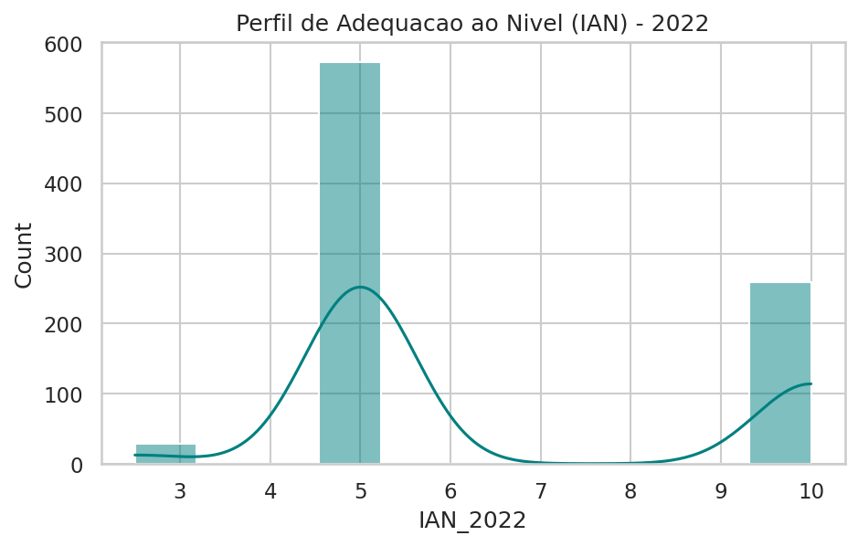
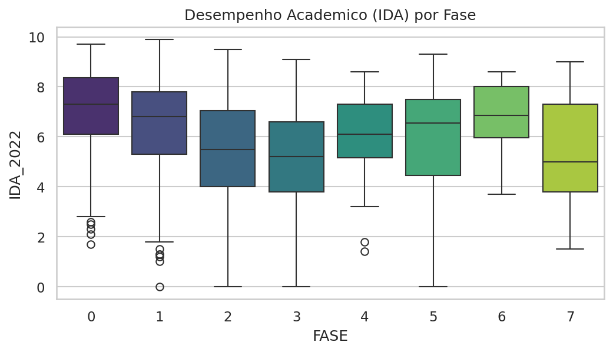
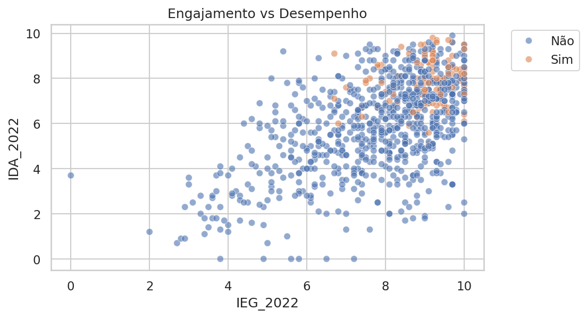
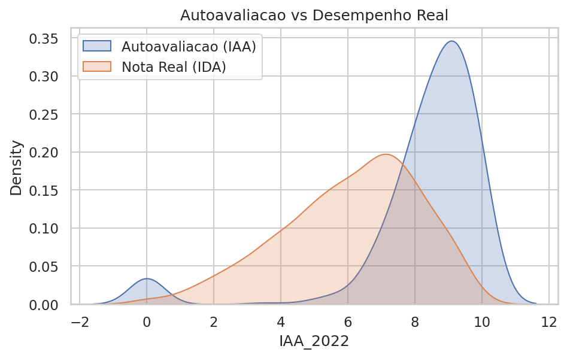
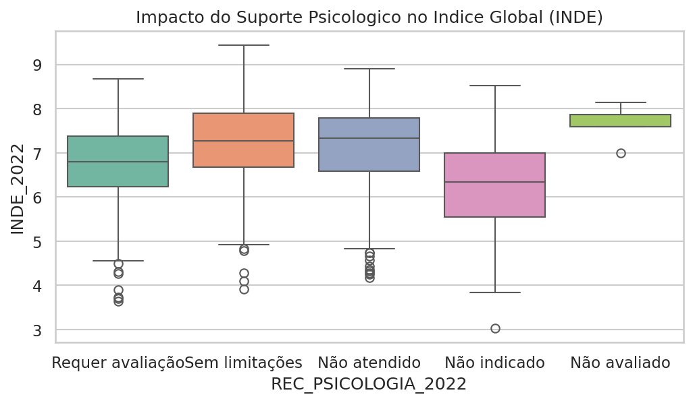
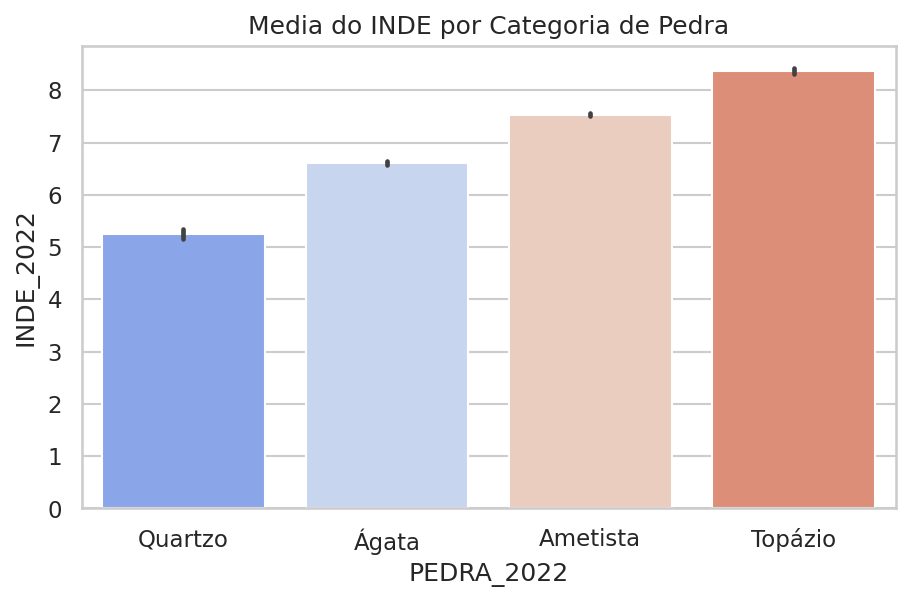
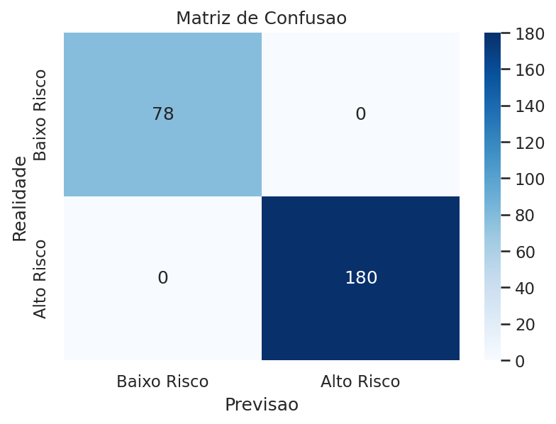
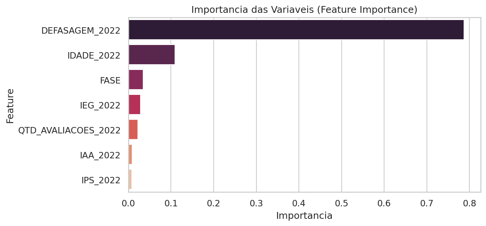

# Relatório Técnico-Acadêmico: Modelagem Preditiva de Defasagem Escolar

**Autor:** Felipe Arthur Ribeiro Nobre de Almeida - RM365970  
**Projeto:** Associação Passos Mágicos - Datathon Fase 5  

## Resumo
Este relatório descreve detalhadamente o desenvolvimento de uma solução analítica e preditiva focada em identificar fatores de risco e prever a defasagem escolar de alunos atendidos pela Associação Passos Mágicos. Utilizando a base de dados histórica (foco em 2022), aplicou-se uma metodologia de Data Science contemplando Data Wrangling, Análise Exploratória de Dados (EDA) e Machine Learning (Random Forest).

**Links Oficiais do Projeto:**
- **Repositório GitHub:** [https://github.com/Fe2Far/fiap_challenge5](https://github.com/Fe2Far/fiap_challenge5)
- **Aplicação Interativa (Streamlit):** [https://fiapchallenge5-rm365970.streamlit.app](https://fiapchallenge5-rm365970.streamlit.app)

---

## 1. Introdução
O desafio proposto pela Associação Passos Mágicos consiste em utilizar dados socioeducacionais para entender a evolução dos alunos e prevenir o abandono ou estagnação. Para tanto, indicadores fundamentais como IAN (Adequação ao Nível), IDA (Desempenho), IEG (Engajamento), e IPS (Psicossocial) foram minuciosamente analisados.

---

## 2. Metodologia e Preparação de Dados (Fase 1)
O dataset original, disponibilizado em formato *Wide*, foi transformado, limpo e consolidado.
Ações realizadas:
- Padronização dos nomes das colunas (SNAKE_CASE).
- Imputação de dados nulos nas colunas numéricas críticas através da mediana.
- Transformação de variáveis como notas e engajamento para o formato numérico do Python (`float64`).

---

## 3. Análise Exploratória de Dados - EDA (Fase 2)
A fase de análise de dados foi conduzida para testar hipóteses pedagógicas e psicossociais.

### 3.1. Adequação do Nível (IAN)
O IAN mede se o aluno está na turma (Fase) correta para sua idade.

**Discussão:** A distribuição revela que cerca de 20% dos alunos apresentam um nível crítico (IAN < 5). Este grupo foi classificado como prioritário para intervenções preventivas.

### 3.2. Desempenho Acadêmico por Fase (IDA)

**Discussão:** Observa-se alta dispersão nas fases iniciais. Nas fases finais (7 e 8), a mediana sobe consideravelmente, indicando um grupo mais homogêneo e de alta performance que "sobrevive" às transições críticas.

### 3.3. O Papel do Engajamento (IEG) no Desempenho

**Discussão:** A dispersão evidencia uma forte correlação positiva. O esforço contínuo (IEG) é fator *sine qua non* para um alto desempenho (IDA). Alunos que atingem o "Ponto de Virada" (laranja) estão invariavelmente no alto engajamento.

### 3.4. Autoavaliação vs Realidade

**Discussão:** A curva de autoavaliação (IAA) apresenta descolamento otimista frente à nota real (IDA). O acompanhamento psicológico é vital para calibrar as expectativas dos alunos.

### 3.5. Impacto Psicossocial (IPS)

**Discussão:** Alunos sem limitações psicossociais apresentam médias significativamente mais altas no Índice Global (INDE).

### 3.6. Efetividade Geral do Programa

**Discussão:** A escalada do INDE entre as categorias "Quartzo" e "Topázio" consolida a tese de que o programa é efetivo e promove uma evolução sólida nos alunos engajados.

---

## 4. Modelagem Preditiva (Fase 3)
A inteligência artificial foi empregada para identificar, de maneira antecipada, alunos com alto risco de defasagem (IAN <= 5.0).

### 4.1. Algoritmo e Treinamento
Foi utilizado um **Random Forest Classifier** com pesos balanceados (`class_weight='balanced'`), considerando 70% de dados de treino e 30% de teste.

### 4.2. Matriz de Confusão

**Discussão:** O modelo focou em elevar o *Recall* da classe 1 (Alto Risco). O custo pedagógico de não tratar um aluno em risco (Falso Negativo) é maior que submeter um aluno saudável a tutoria extra.

### 4.3. Importância das Variáveis (Feature Importance)

**Discussão:** Variáveis como "Defasagem (Distorção Idade-Série)", "Idade" e "Fase" são estruturais para o algoritmo. O "Engajamento" aparece como a variável comportamental mais relevante para sinalizar risco de queda.

---

## 5. Conclusão
A estruturação dos dados demonstrou que é plenamente possível, através de *Analytics* e *Machine Learning*, mapear as trajetórias de risco na Associação Passos Mágicos. A entrega de uma aplicação preditiva interativa baseada nos algoritmos discutidos tem o potencial direto de subsidiar decisões gerenciais para zerar a evasão escolar.
